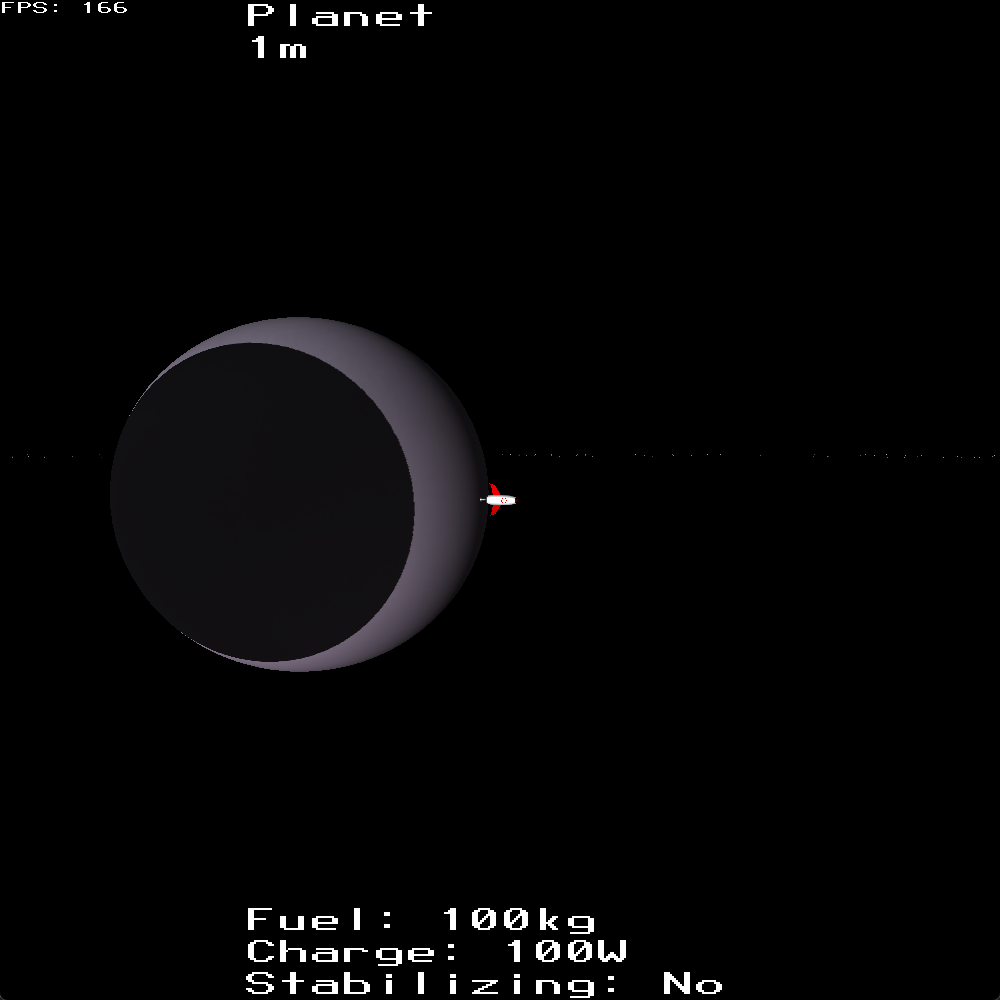
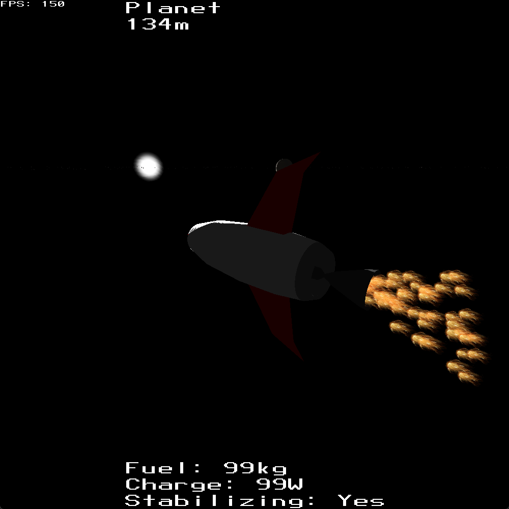
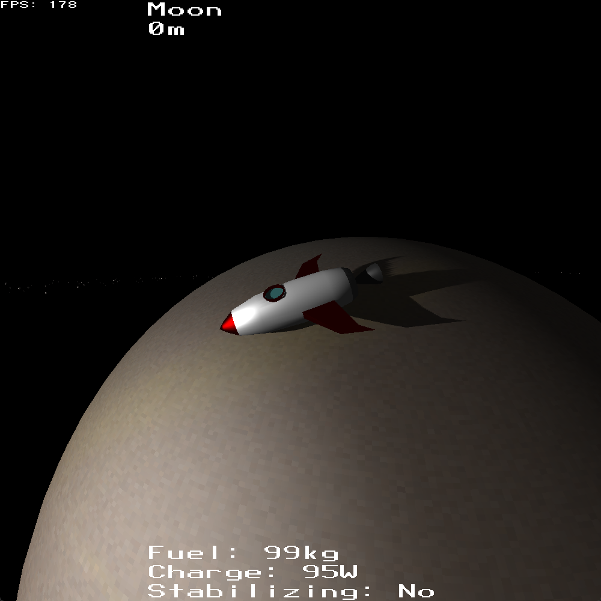

# Rocket and planets

A solar system and rocket simulation together with a game engine.

## Team members

- [Păcurariu Răzvan Mihai](https://github.com/razvanpacku)
- [Luparu Ioan Teodor](https://github.com/BrainDBD)

## Overview

This repo implements an OpenGL game engine, which supports batched rendering, cascaded shadow mapping and frustrum culling; together with a scene graph system for game logic, having a transform system, and a physics/collision system. Gui rendering is also supported, with a similar transform system.

On top of this engine a simple demo was built involving a small planet system with a planet, a moon, and an asteroid ring. A rocket is present on the planet on game startup, being gravitationally attracted to the planet and moon.  It can be controled by pressing `space` to enable its engine, or with `w`/`a`/`s`/`d`/`q`/`e` to rotate it. A rotation stabilization mode can be toggled on or off by pressing `r`.

## Images







## Build & run

### Prerequisites

- Windows with Visual Studio (MSVC) or MSBuild.
- GPU/drivers supporting OpenGL. (Project includes GLAD/GLFW/GLM headers in the repo.)

### Building

- Recommended: open the solution in Visual Studio
    1. Open [Project.sln](Project.sln) in Visual Studio.
    2. Select Platform = x64 (if needed) and Configuration = Debug or Release.
    3. Build -> Build Solution.
- Command line (MSBuild)
```sh
msbuild Project.sln /p:Configuration=Release /p:Platform=x64
```

### Run

- From Visual Studio: Start Debugging / Start Without Debugging
- From command line: run the built executable (example paths below — adjust for Debug/Release)
```sh
cd x64/Release
Project.exe
```